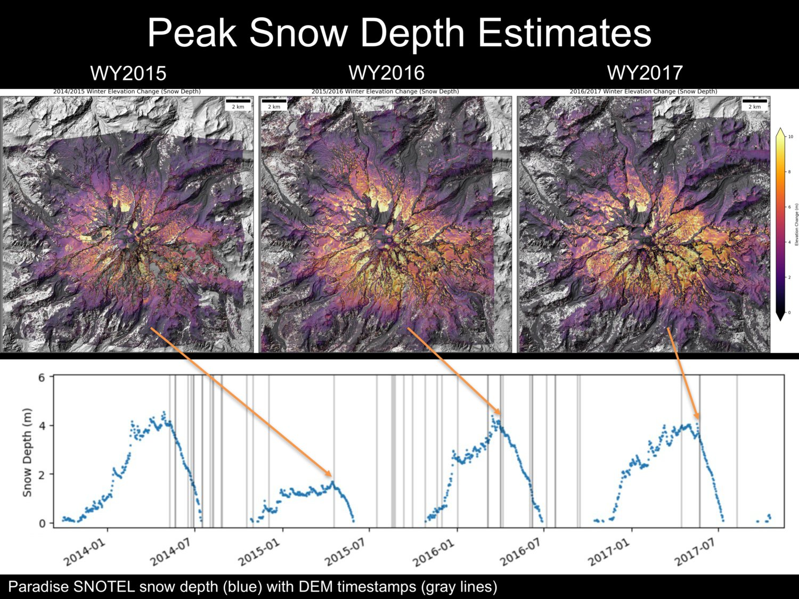

# snowtools 
A collection of tools for processing and analyzing snow data

## Features
- Automated querying and processing of SNOTEL data from CUAHSI database
- Processing and analysis of NASA SnowEx campaign data
- Automated retrieval and processing of MODSCAG fracitonal snow-covered area (fSCA) products
- Automated retrieval and processing of SNODAS model snow depth 

## Examples

## Tools 
- `get_snotel.py` - retrieve SNOTEL data for a given input extent (e.g., raster snow depth map from &#916;DEM)
  - Note: can use [`compute_dz.py`](https://github.com/dshean/demcoreg/blob/master/demcoreg/compute_dz.py) in demcoreg repo to compute snow depth from two arbitrary input DEMs (e.g. LiDAR, SfM, satellite stereo)
- `swe.py` - convert snow depth raster to snow water equivalent (SWE)  
- `get_modscag.py` - extract MODSCAG fSCA for a given date to match another raster (e.g. LS8 image, DEM)
- `get_snodas.py` - extract SNODAS model snow depth for a given date to match another raster (e.g. LS8 image, DEM)

## Future
- Implement multiple snow models (e.g., Sturm et al. [2010]) to estimate density for arbitrary location and timestamp

### Core requirements

- [pygeotools](https://github.com/dshean/pygeotools)

### Optional requirements

- [ulmo](https://github.com/ulmo-dev/ulmo)
